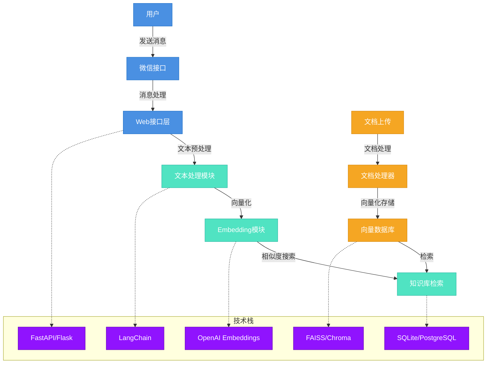

## 技术细节说明

### 1. 用户交互层
- **微信接口**: 使用 itchat 或 WeChat SDK 实现微信消息的接收和发送
- **Web接口层**: 基于 FastAPI/Flask 构建的 RESTful API，处理 HTTP 请求

### 2. 核心处理层
- **文本处理模块**: 
  - 使用 LangChain 进行文本分割和预处理
  - 支持多种文档格式（PDF、Word、Excel等）
  - 实现文本清洗和标准化

- **Embedding模块**:
  - 使用 OpenAI 的 text-embedding-ada-002 模型
  - 支持批量文本向量化
  - 实现向量缓存机制

- **知识库检索**:
  - 基于 FAISS/Chroma 的向量相似度搜索
  - 支持多维度相似度计算
  - 实现结果排序和过滤

### 3. 知识库管理
- **文档处理器**:
  - 支持多种文档格式解析
  - 实现文档分块和索引
  - 提供文档更新和删除功能

- **向量数据库**:
  - 使用 FAISS/Chroma 存储向量数据
  - 支持增量更新
  - 实现数据持久化

### 4. 数据存储
- 使用 SQLite/PostgreSQL 存储元数据
- 实现数据备份和恢复机制
- 支持数据版本控制

### 5. 性能优化
- 实现向量检索的缓存机制
- 支持批量处理和大规模数据
- 优化内存使用和查询性能 