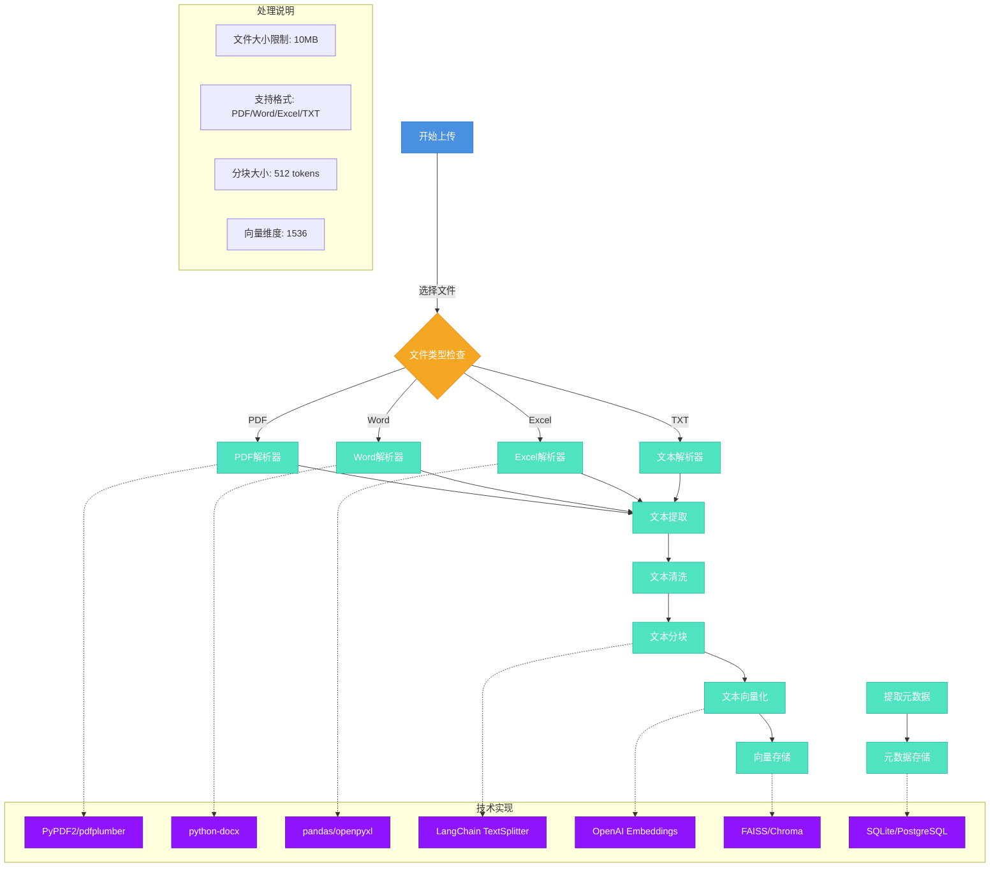

## 知识库上传流程说明

### 1. 文件上传阶段
- **文件类型检查**
  - 支持的文件格式：PDF、Word、Excel、TXT
  - 文件大小限制：10MB
  - 使用文件扩展名和MIME类型进行验证

### 2. 文档解析阶段
- **PDF解析**
  - 使用 PyPDF2/pdfplumber 进行PDF文本提取
  - 支持表格和图片OCR（可选）
  - 保留文档结构和格式信息

- **Word解析**
  - 使用 python-docx 处理Word文档
  - 提取文本、表格和图片
  - 保留文档样式信息

- **Excel解析**
  - 使用 pandas/openpyxl 处理Excel文件
  - 支持多sheet处理
  - 保留表格结构和数据类型

- **文本解析**
  - 支持UTF-8编码
  - 处理特殊字符和换行符
  - 支持大文件分块读取

### 3. 文本处理阶段
- **文本清洗**
  - 去除特殊字符和多余空白
  - 统一文本格式
  - 处理中英文混排

- **文本分块**
  - 使用 LangChain TextSplitter
  - 基于语义和长度进行分块
  - 默认块大小：512 tokens
  - 支持重叠分块

### 4. 向量化处理
- **文本向量化**
  - 使用 OpenAI Embeddings (text-embedding-ada-002)
  - 向量维度：1536
  - 支持批量处理
  - 实现错误重试机制

### 5. 存储处理
- **向量存储**
  - 使用 FAISS/Chroma 向量数据库
  - 支持增量更新
  - 实现向量索引优化
  - 支持相似度搜索

- **元数据存储**
  - 使用 SQLite/PostgreSQL
  - 存储文档信息、分块信息
  - 支持版本控制
  - 实现数据备份

### 6. 性能优化
- 实现并行处理
- 支持断点续传
- 实现进度跟踪
- 优化内存使用 